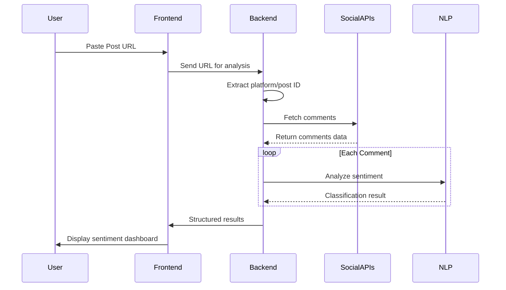

# SocialSentinel: Real-time Social Media Comment Analyzer


**SocialSentinel** is an open-source application that analyzes social media comments in real-time, categorizing them into positive, negative, and neutral sentiments. Simply paste any social media post URL to get instant sentiment analysis.

## 🚀 Features

- **Multi-Platform Support**: Works with Twitter, Reddit, Facebook, Instagram, and more
- **Real-time Analysis**: Get sentiment results within seconds
- **Three-Category Classification**:
  - ✅ Positive (aligns with post)
  - ❌ Negative (opposes post)
  - ⚖️ Neutral (balanced/centralist)
- **Visual Analytics**: Interactive charts and sentiment breakdowns
- **Export Options**: Download results as CSV or JSON

## 🛠️ Technology Stack

### Core Components
| Component | Technology |
|-----------|------------|
| **Frontend** | React.js, Tailwind CSS, Chart.js |
| **Backend** | Python (FastAPI), Node.js |
| **NLP Engine** | HuggingFace Transformers, spaCy |
| **APIs** | Tweepy (Twitter), PRAW (Reddit), Facebook Graph API |
| **Database** | Redis (caching), PostgreSQL |
| **Infrastructure** | Docker, Kubernetes, AWS/GCP |
| **Task Queue** | Celery, RabbitMQ |

## 📊 How It Works



## 💻 Getting Started (Development)

### Prerequisites
- Python 3.9+
- Node.js 16+
- Redis server
- Social media API keys (Twitter, Reddit, Facebook)

### Installation

1. Clone the repository:
```bash
git clone https://github.com/zangticsdigital/socialsentinel.git
cd socialsentinel
```

2. Set up backend:
```bash
cd backend
python -m venv venv
source venv/bin/activate
pip install -r requirements.txt
```

3. Configure environment variables:
```bash
cp .env.example .env
# Fill in your API keys in .env
```

4. Set up frontend:
```bash
cd ../frontend
npm install
```

5. Run the development environment:
```bash
# In backend directory:
uvicorn main:app --reload

# In frontend directory:
npm start
```

## 🌟 Join the Project

We're looking for contributors to help build SocialSentinel! Here's how you can get involved:

### Needed Roles:
- Python Developers (FastAPI, NLP)
- JavaScript/React Developers
- DevOps Engineers (Docker, Kubernetes)
- Data Scientists (sentiment analysis)
- UI/UX Designers
- Technical Writers

### How to Contribute:
1. Check our [Project Board](https://github.com/zangticsdigital/socialsentinel/projects/1) for open tasks
2. Look for "good first issue" labels for beginner-friendly tasks
3. Fork the repository and create a feature branch
4. Submit a pull request with your changes

### First-Time Contributors:
We welcome new contributors! Join our [Discord Server](https://discord.gg/zangtics) for guidance.

## 📜 License
This project is licensed under the Apache License 2.0 - see [LICENSE](LICENSE) for details.

## 📬 Contact
- **Project Lead**: [Your Name Here!]
- **Email**: [contact@zangticsdigital.com]
- **Website**: [https://www.zangticsdigital.com]
- **Discord**: [Join our community](https://discord.gg/zangtics)

---

**Let's build the future of social media analytics together!** ✨

[](CODE_OF_CONDUCT.md)

---

## Suggested Next Steps:
1. Create a GitHub repo under your organization
2. Add this README.md file
3. Set up basic project structure with:
   - `/frontend` for React app
   - `/backend` for FastAPI server
   - `/nlp` for sentiment analysis models
   - `/docs` for documentation
4. Create CONTRIBUTING.md with detailed guidelines
5. Set up project boards with initial milestones

Would you like me to provide any of these additional files?
- CONTRIBUTING.md template
- FastAPI server boilerplate code
- React component structure
- Dockerfile examples
- API documentation template
