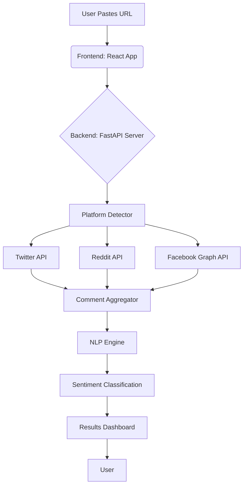
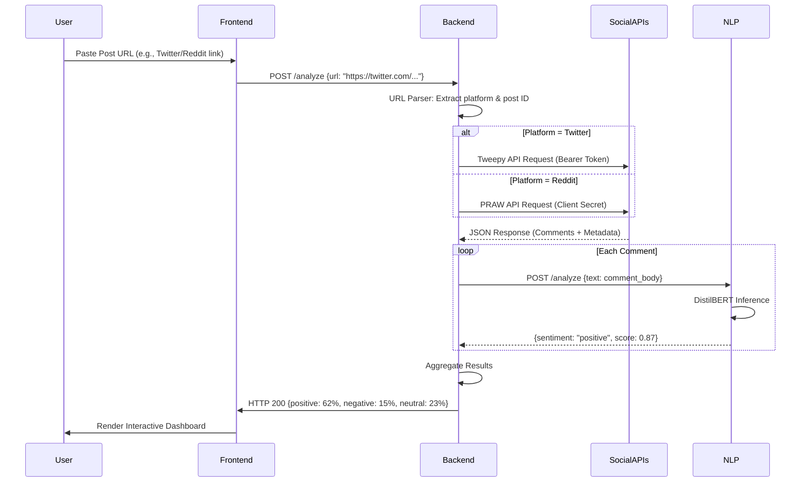

Here's the enhanced README with a detailed **How It Works** diagram, **sequence diagram**, and **installation steps**:

---

# **Sentio AI: Advanced Social Media Sentiment Analyzer**  
**Owned and Developed by Zangtics Digital**  


---

## **🔍 How It Works**  

### **System Diagram**  


### **Step-by-Step Sequence**  


---

## **🛠️ Installation & Setup**  

### **Prerequisites**  
- Python 3.10+  
- Node.js 18+  
- Redis Server  
- Social Media API Keys:  
  - [Twitter Developer Portal](https://developer.twitter.com)  
  - [Reddit App Credentials](https://www.reddit.com/prefs/apps)  
  - [Facebook Developer Account](https://developers.facebook.com)  

### **1. Backend Setup**  
```bash
# Clone the repository (private repo access required)
git clone https://github.com/zangticsdigital/sentio-ai.git
cd sentio-ai/backend

# Create virtual environment
python -m venv venv
source venv/bin/activate  # Linux/Mac
venv\Scripts\activate     # Windows

# Install dependencies
pip install -r requirements.txt

# Configure environment variables
cp .env.example .env
# Edit .env with your API keys:
TWITTER_BEARER_TOKEN=your_key_here
REDDIT_CLIENT_ID=your_id_here
REDDIT_CLIENT_SECRET=your_secret_here
```

### **2. NLP Service Setup**  
```bash
cd ../nlp-service
docker build -t sentio-nlp .
docker run -p 5001:5001 sentio-nlp
```

### **3. Frontend Setup**  
```bash
cd ../frontend
npm install
# Configure API endpoint
echo "VITE_API_URL=http://localhost:8000" > .env
```

### **4. Run the System**  
```bash
# Terminal 1: Start Backend
cd backend && uvicorn main:app --reload

# Terminal 2: Start Frontend
cd ../frontend && npm run dev

# Terminal 3: Start Celery Worker (for async tasks)
celery -A tasks worker --loglevel=info
```

Access the app at:  
🌐 [http://localhost:3000](http://localhost:3000)

---

## **📊 Sentiment Analysis Logic**  
```python
# Example NLP Classification (backend/services/nlp.py)
from transformers import pipeline

class SentimentAnalyzer:
    def __init__(self):
        self.model = pipeline(
            "sentiment-analysis",
            model="distilbert-base-uncased-finetuned-sst-2-english",
            device="cuda"  # Use GPU if available
        )
    
    def classify(self, text: str) -> dict:
        result = self.model(text)[0]
        if result['score'] >= 0.7:
            return {"sentiment": "positive", "confidence": result['score']}
        elif result['score'] <= 0.3:
            return {"sentiment": "negative", "confidence": 1 - result['score']}
        else:
            return {"sentiment": "neutral", "confidence": 0.5}
```

---

## **📌 Key Technical Components**  

| Component | Purpose | Technology |
|-----------|---------|------------|
| **URL Router** | Detect platform from URL | Python (FastAPI Router) |
| **API Proxy** | Handle platform-specific APIs | Requests + OAuth2 |
| **Comment Queue** | Process high-volume comments | Redis + Celery |
| **Sentiment Engine** | Real-time classification | HuggingFace Transformers |
| **Dashboard** | Visualize results | React + D3.js |

---

## **🔒 Security Notes**  
- All API requests are **rate-limited** to comply with platform policies  
- Comment data is **never stored permanently** without user consent  
- Uses **JWT authentication** for API endpoints  

---

**© 2024 Zangtics Digital. Proprietary Technology.**  
For licensing inquiries: legal@zangticsdigital.com  

--- 

Would you like me to add:  
1. Detailed API documentation?  
2. Screenshots of the dashboard UI?  
3. Deployment guide for AWS/GCP?
